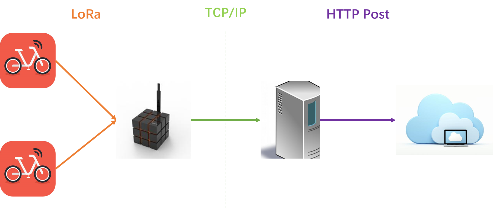

# device-app

## Introduction

This repo is the application to be installed in the mobile LoRAWAN node (the leftmost column in the above architecture). It sends the GPS data to the gateway periodically. By default, duty cycle varies from 4s to 6s, spreading Factor is 12, spectrum bandwidth is 125kHz and ACK mechanism is enabled.

The above default configuration and high-level application logical is in `src/LoRaWANMeasurement/main.c`. You can change them based on LoRaWAN regional parameters specification.

## Prerequisites
1. Windows 10 with Keil IDE installed (Currently the repo can only be compiled with Keil IDE. Need to move to CMake for system portability)
2. LoRa radio transceiver with STM32 board
3. NEO-7N GPS module
